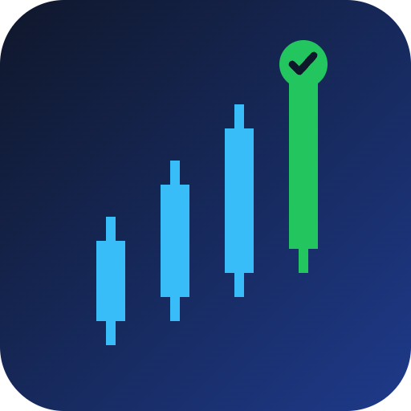

# TrendPilot


AI-filtered 15m trend-following signal bot with non-custodial wallet execution.

## Overview

TrendPilot combines classic 15-minute trend-following indicators with a lightweight machine learning classifier trained to filter false breakouts, sending high-confidence trade signals via Telegram and Discord. Users connect their own Solana wallet, and the bot requests signature approval for each trade, keeping the system fully non-custodial.

## Problem

Pure technical-indicator trend bots generate many false signals in choppy markets. On short timeframes like 15 minutes, this noise erodes trust and consistency, leading traders to either over-trade or ignore signals altogether.

## Solution

TrendPilot filters classic trend-following signals (EMA/ADX) through an ML classifier trained on historical 15-minute candle patterns. Only higher-confidence signals are delivered to the user. Execution stays fully in the user's hands: trades are approved and signed from their own Solana wallet, with no funds ever custodied by TrendPilot.

## Features (MVP)

- 15m trend-following signal engine (EMA/ADX) for BTC, ETH, and SOL
- ML classifier trained on historical candles to filter false breakouts
- Telegram/Discord bot delivering ranked, confidence-scored signals
- One-click trade approval via Solana wallet (Actions/Blinks) for execution
- Dashboard tracking signal win-rate and live/backtest performance

## Tech Stack

- Python, scikit-learn
- Pyth Network (price data)
- Solana Actions/Blinks (one-click, non-custodial execution)
- Drift SDK (on-chain order execution)
- Telegram Bot API

## How It Works

```
[Pyth Network 15m candles]
          |
          v
[EMA/ADX Trend Engine] --> raw trend signal
          |
          v
[ML Classifier (scikit-learn)] --> confidence-scored signal
          |
          v
[Telegram/Discord Bot] --> alert sent to user
          |
          v
[User reviews signal]
          |
          v
[Solana Actions/Blinks] --> user signs with own wallet
          |
          v
[Drift SDK] --> trade executed on-chain
```

No funds are ever deposited into TrendPilot. Each trade is only executed after the user signs it with their own wallet.

## Roadmap

- Expand the ML model with more features and a live retraining pipeline
- Add portfolio-level risk management across BTC/ETH/SOL positions
- Launch a mobile app with push notifications and in-app execution

## Pitch

- [Pitch deck (PDF)](docs/pitch.pdf)
- [Pitch script](docs/pitch-script.md)

## Team

- Name - Role - [GitHub](#) / [Twitter](#)
- Name - Role - [GitHub](#) / [Twitter](#)

Built for the Colosseum hackathon (Solana and other chains).

---

🎬 Pitch video: [docs/pitch-video.mp4](docs/pitch-video.mp4)
